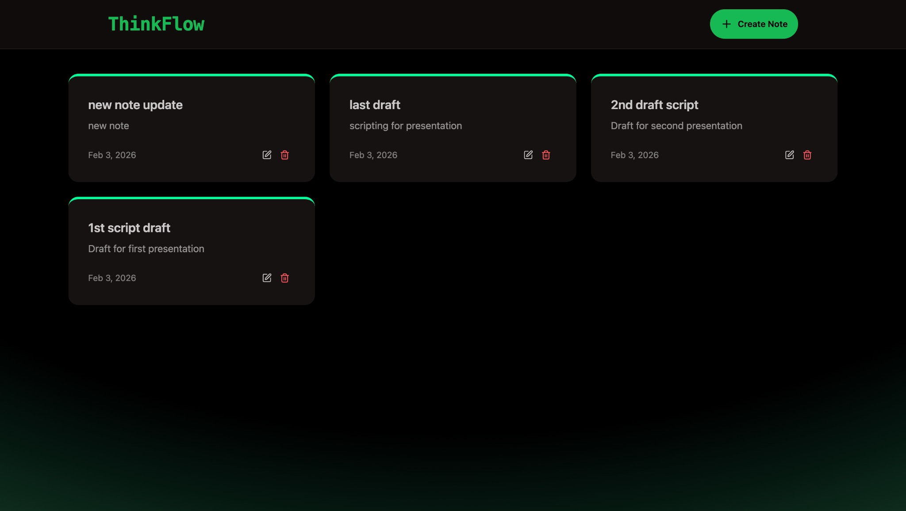
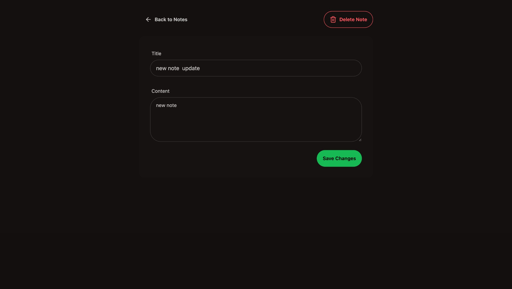
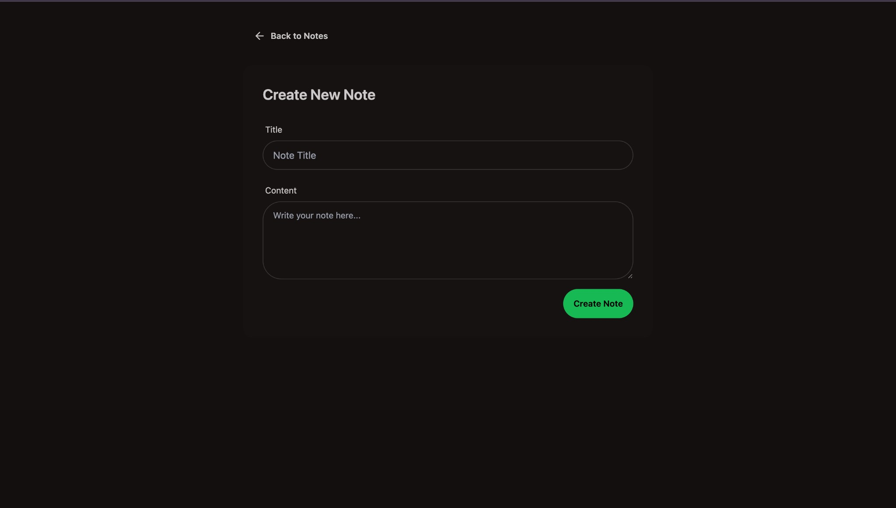

# ThinkFlow — Full-Stack Notes App

[](https://www.mongodb.com/)
[](https://expressjs.com/)
[](https://react.dev/)
[](https://nodejs.org/)
[](https://vitejs.dev/)
[](https://tailwindcss.com/)

A modern, production-ready **MERN stack** notes application with a clean UI, RESTful API, and rate limiting. Built to demonstrate full-stack development, API design, and deployment practices.

---

## ✨ Live Demo

**[→ Try ThinkFlow live](https://your-app-name.onrender.com)** *(Replace with your Render URL after deployment)*

---

## 📸 Screenshots

| **Dashboard** — View and manage all notes | **Note detail** — Edit or delete a note | **Create note** — Add a new note |
|:---:|:---:|:---:|
|  |  |  |

---

## 🎯 Why This Project?

- **Full-stack ownership** — From database design and API to UI and deployment.
- **Production-minded** — Environment-based config, CORS, rate limiting, and error handling.
- **Modern tooling** — ES modules, Vite, React 19, and a monorepo-friendly setup.
- **Deployable** — One-command build and start; ready for Render, Railway, or similar platforms.

---

## 🛠 Tech Stack

| Layer      | Technologies |
|-----------|--------------|
| **Frontend** | React 19, React Router 7, Vite 7, Tailwind CSS, DaisyUI, Lucide React, Axios, React Hot Toast |
| **Backend**  | Node.js, Express 4, ES modules |
| **Database** | MongoDB (Mongoose 7) |
| **Infra**    | Upstash Redis (rate limiting), dotenv, CORS |
| **Deploy**   | Render (or any Node host); frontend built and served by Express in production |

---

## 📋 Features

- **CRUD notes** — Create, read, update, and delete notes with a simple, responsive UI.
- **RESTful API** — Structured endpoints for notes; easy to extend or consume by other clients.
- **Rate limiting** — Upstash Redis–backed rate limiting to protect the API and improve resilience.
- **Responsive UI** — Mobile-friendly layout with Tailwind and DaisyUI.
- **Toast notifications** — User feedback for success and error states.
- **Single deployment** — Backend serves the built React app in production (no separate frontend host required).

---

## 📁 Project Structure

```
MERN-THINKBOARD/
├── backend/
│   ├── src/
│   │   ├── config/       # DB connection, Upstash Redis
│   │   ├── controllers/  # Note CRUD logic
│   │   ├── middleware/   # Rate limiter
│   │   ├── models/       # Mongoose Note schema
│   │   ├── routes/       # API routes
│   │   └── server.js     # Express app entry
│   ├── .env.example
│   └── package.json
├── frontend/
│   ├── src/
│   │   ├── components/   # Navbar, NoteCard, NotesNotFound, RateLimitedUI
│   │   ├── lib/          # Axios instance, utils
│   │   ├── pages/        # Home, Create, NoteDetail
│   │   ├── App.jsx
│   │   └── main.jsx
│   ├── index.html
│   └── package.json
├── package.json          # Root scripts: build, start
├── screenshots/          # App screenshots for README
├── RENDER_DEPLOY.md      # Render deployment steps
└── README.md
```

---

## 🚀 Getting Started

### Prerequisites

- **Node.js** 18+ (recommend LTS)
- **MongoDB** — [MongoDB Atlas](https://www.mongodb.com/cloud/atlas) (free tier works)
- **Upstash Redis** — [Upstash](https://upstash.com/) (free tier for rate limiting)

### 1. Clone and install

```bash
git clone https://github.com/mirnabadr/MERN-ThinkFlow-Notes-.git
cd MERN-ThinkFlow-Notes-
npm run build
```

*(Root `build` installs backend + frontend deps and builds the frontend.)*

### 2. Environment variables

```bash
cp backend/.env.example backend/.env
```

Edit `backend/.env` and set:

| Variable | Description |
|----------|-------------|
| `MONGO_URI` | MongoDB connection string (e.g. from Atlas) |
| `PORT` | Server port (default `5001`) |
| `UPSTASH_REDIS_REST_URL` | Upstash Redis REST URL |
| `UPSTASH_REDIS_REST_TOKEN` | Upstash Redis REST token |
| `NODE_ENV` | `development` locally; `production` when deployed |

Use **no spaces** around `=` (e.g. `MONGO_URI=mongodb+srv://...`).

### 3. Run the app

**Production mode (single process, serves built frontend):**

```bash
npm run start
```

Open [http://localhost:5001](http://localhost:5001).

**Development (API + frontend dev server):**

- Terminal 1 — API: `npm run start --prefix backend` (or `cd backend && npm run dev` if you use nodemon).
- Terminal 2 — Frontend: `npm run dev --prefix frontend`.  
- Frontend: [http://localhost:5173](http://localhost:5173); API: [http://localhost:5001](http://localhost:5001).

---

## 📡 API Overview

| Method | Endpoint | Description |
|--------|----------|-------------|
| `GET` | `/api/notes` | List all notes (newest first) |
| `GET` | `/api/notes/:id` | Get one note by ID |
| `POST` | `/api/notes` | Create a note (`title`, `content`) |
| `PUT` | `/api/notes/:id` | Update a note |
| `DELETE` | `/api/notes/:id` | Delete a note |

Responses are JSON. Rate limiting returns `429` with a message when the limit is exceeded.

---

## 🌐 Deployment (Render)

1. Connect this repo to [Render](https://render.com) as a **Web Service**.
2. **Build command:** `npm run build`
3. **Start command:** `npm run start`
4. Add environment variables in the Render dashboard: `MONGO_URI`, `UPSTASH_REDIS_REST_URL`, `UPSTASH_REDIS_REST_TOKEN`, `NODE_ENV=production`. Do **not** set `PORT`; Render sets it.

See **[RENDER_DEPLOY.md](./RENDER_DEPLOY.md)** for step-by-step instructions and variable details.

---

## 📄 License

This project is open source and available under the [ISC License](https://opensource.org/licenses/ISC).

---

## 👋 Let's Connect

I built this project to showcase full-stack skills and clean, deployable code. If you’re hiring or collaborating, I’d love to hear from you.

- **GitHub:** [@mirnabadr](https://github.com/mirnabadr)
- **Repo:** [MERN-ThinkFlow-Notes-](https://github.com/mirnabadr/MERN-ThinkFlow-Notes-)

*Open to opportunities and feedback — feel free to open an issue or reach out.*
